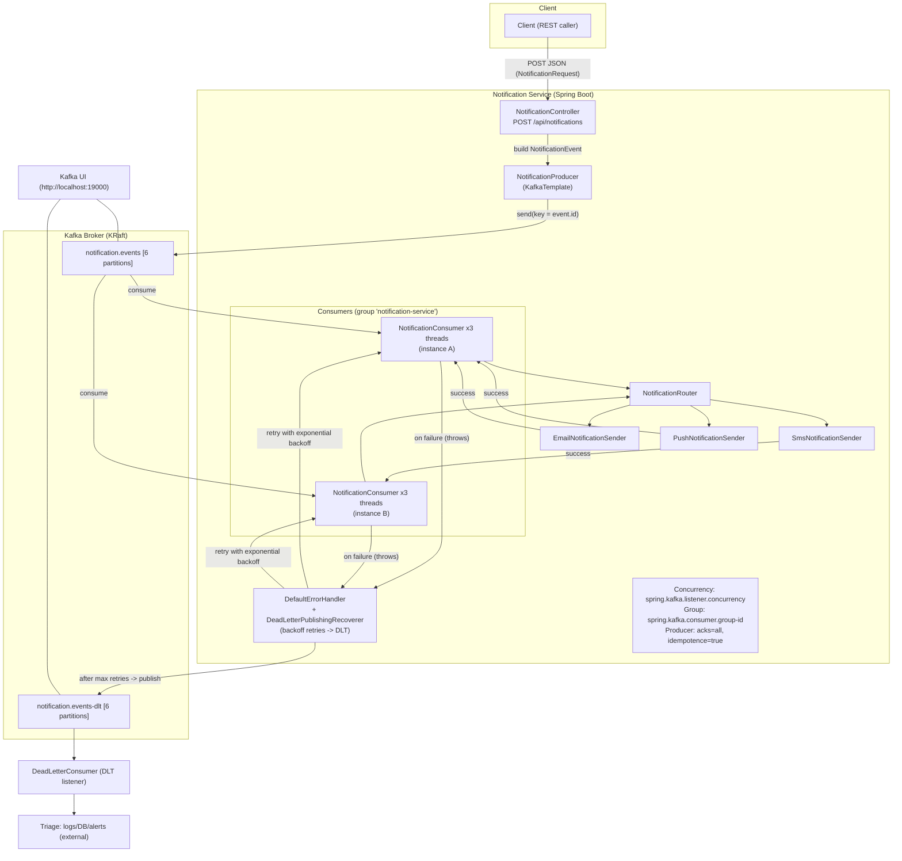
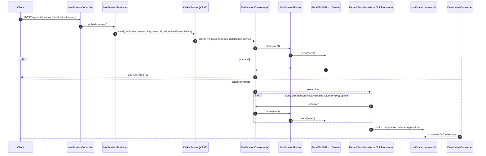
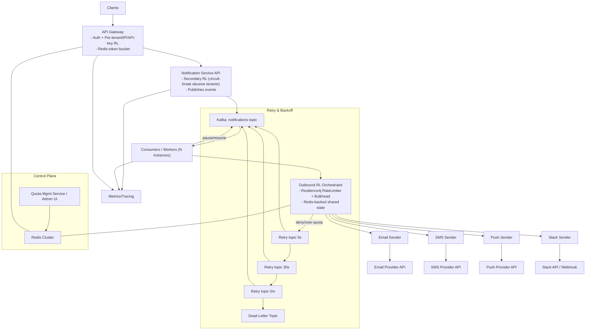

# Notification Service with Kafka and Dead Letter Queue

## Run Kafka

```bash
cd "$(dirname "$0")/../kafka" && docker compose up -d
```

Kafka UI: http://localhost:19000

## Run the Service

```bash
cd ../notification-service
./mvnw spring-boot:run
```

## Send a Notification

```bash
curl -X POST http://localhost:8080/api/notifications \
  -H 'Content-Type: application/json' \
  -d '{
    "recipient": "user@example.com",
    "channel": "EMAIL",
    "subject": "Test",
    "message": "Hello",
    "metadata": {"orderId": "123"}
  }'
```

To test DLQ, set subject including the text "fail".

## Topics

- notification.events
- notification.events-dlt

## Architecture



## Request-to-DLQ sequence



## Detailed configuration notes

- Broker and topics
  - spring.kafka.bootstrap-servers=localhost:9092: producer/consumer connect here.
  - spring.kafka.admin.auto-create=true: Spring creates topic beans on startup.
  - `KafkaConfig.notificationsTopic()` and `notificationsDltTopic()` create `notification.events` and `notification.events-dlt` with 6 partitions.

- Producer (`KafkaConfig.producerFactory()`)
  - acks=all, enable.idempotence=true, max.in.flight=5, retries=Integer.MAX_VALUE for safe, ordered delivery.
  - key serializer: String; value serializer: Json.
  - `NotificationProducer.publish(...)` builds `NotificationEvent` and sends with key=event.id.

- Consumer (`KafkaConfig.consumerFactory()`)
  - group.id: spring.kafka.consumer.group-id=notification-service.
  - value.deserializer: JsonDeserializer configured via properties only:
    - JsonDeserializer.VALUE_DEFAULT_TYPE=NotificationEvent
    - JsonDeserializer.TRUSTED_PACKAGES=com.example.notification.*
    - JsonDeserializer.USE_TYPE_INFO_HEADERS=false
  - auto.offset.reset=earliest, enable.auto.commit=false.

- Listener container (`KafkaConfig.kafkaListenerContainerFactory()`)
  - concurrency: spring.kafka.listener.concurrency (default 3).
  - common error handler: DefaultErrorHandler.

- Retries and DLQ
  - DefaultErrorHandler with ExponentialBackOffWithMaxRetries(5): initial=500ms, multiplier=2.0, max=10s.
  - DeadLetterPublishingRecoverer routes failures to `notification.events-dlt` (same partition).
  - `DeadLetterConsumer` listens on DLT for triage/persistence.

- REST API and processing
  - POST /api/notifications -> `NotificationController` -> `NotificationProducer`.
  - `NotificationConsumer` receives, `NotificationRouter` dispatches to `Email/Sms/Push` senders.

- Scaling controls
  - Partitions: 6 (increase for more parallelism across instances).
  - spring.kafka.listener.concurrency: threads per instance.
  - Multiple instances with same group share load by partition assignment.


## Rate Limiting Architecture

- **Goals**: protect APIs from abuse, ensure fair-use per tenant, and throttle provider calls to stay within vendor limits while maximizing throughput.

### Inbound rate limiting (client → your API)
- **API Gateway/WAF** (Kong/NGINX/Envoy or cloud GW):
  - **Policies**: per-IP, per-API-key, per-tenant, per-endpoint; sliding window or token bucket.
  - **State store**: Redis cluster for counters/tokens; co-located to minimize latency.
  - **Burst control**: short TTL buckets for bursts; longer windows for sustained rates.
- **Secondary app-level limiter** in Notification Service API:
  - Circuit-break abusive tenants and fail fast before publishing to Kafka.
- **Observability**: export metrics/logs with keys (tenant_id, endpoint, status=limited).

### Queue decoupling
- **Kafka** absorbs spikes; topic partitions enable horizontal scaling of consumers.

### Outbound rate limiting (workers → providers)
- **Per-provider orchestrator** inside workers:
  - Resilience4j RateLimiter + Bulkhead + Retry for Email/SMS/Push/Slack.
  - **Shared limits**: Redis-backed token buckets (Lua) for cluster-wide fairness; fallback to local memory if Redis unavailable.
  - **Granularity**: global provider limits and per-destination limits (e.g., Slack workspace/channel/webhook).
- **Queue shaping**:
  - If limiter denies, requeue to scheduled retry topics (5s, 30s, 5m) with exponential backoff.
  - After max retries, route to DLT with context.

### Quotas and control-plane
- **Quota Management Service** (future): CRUD for per-tenant quotas and per-provider policies; stores config in Redis with versioning; warm caches inside gateway and workers with TTL + event-driven invalidation.

### Failure handling and protections
- **Circuit breakers**: trip on provider 429/5xx surges; open state shifts traffic to retry topics.
- **Bulkheads**: separate thread pools per provider to prevent head-of-line blocking.
- **Idempotency**: event IDs to dedupe on retries.
- **Priority lanes**: optional high-priority Kafka topic and separate limiter keys for premium tenants.

### Storage/tech choices
- **Redis**: token buckets/leaky buckets via atomic Lua; keys like `rl:in:{tenant}`, `rl:out:slack:{workspace}`, `rl:out:slack:channel:{id}`.
- **Resilience4j**: programmatic guards in senders.
- **Kafka**: main topic + retry topics + DLT.

### Operational
- **Metrics**:
  - Inbound: limited requests, tokens remaining, per-tenant rates.
  - Outbound: acquired/denied tokens, provider 429s, retries, queue depths.
- **Dashboards/alerts**: thresholds on 429s, limiter denies, DLT growth.
- **Runbooks**: temporarily raise tenant quotas or lower worker concurrency during provider incidents.

### Diagram


### Further reading
- See `docs/RATE_LIMITING.md` for a detailed design covering inbound/outbound policies, Redis token buckets, retry topics, quotas, metrics, and capacity planning.


