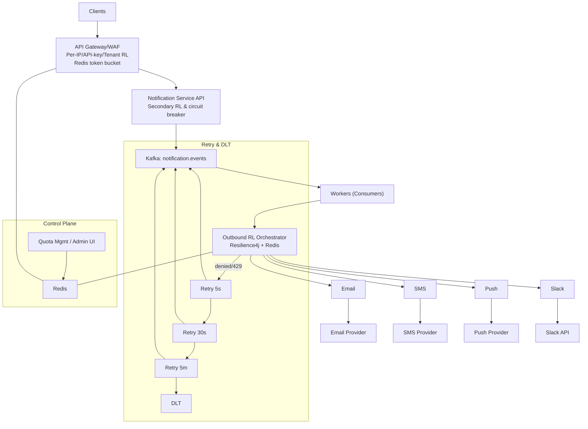

# Rate Limiting Design (Inbound and Outbound)

This document describes a production-ready rate limiting design for the Notification Service. It covers inbound limits (clients → API) and outbound limits (workers → providers), quotas, retry/backoff, observability, capacity planning, and testing.

## Goals
- Protect public APIs from abuse and accidental floods
- Ensure fair-use per tenant/API key while allowing controlled bursting
- Respect provider/vendor limits (e.g., Slack, SMS, Email) to avoid 429s and bans
- Maintain high throughput and stable latencies during spikes
- Provide clear operations metrics, alerts, and controls

## High-level architecture


---

## Inbound Rate Limiting (Clients → API)

### Policies
- By IP, API key, tenant, and endpoint path
- Algorithms: token bucket (preferred) or sliding window with leaky bucket smoothing
- Bursting: allow short bursts, enforce sustained RPS ceilings

### Storage
- Redis for counters/tokens (clustered, with persistence disabled for hot keys)
- Keys (examples):
  - `rl:in:tenant:{tenantId}:ep:{endpoint}:sec`
  - `rl:in:apikey:{apiKey}:sec`
  - `rl:in:ip:{ip}:sec`

### Token bucket (Redis Lua)
- State: `tokens`, `last_refill_ts`
- Refill rate: `rate_per_sec`, capacity: `burst_size`
- Atomic acquire script (pseudo-Lua):

```lua
-- KEYS[1] = state key
-- ARGV[1] = now_ms, ARGV[2] = rate_per_sec, ARGV[3] = burst_cap, ARGV[4] = cost (usually 1)
local state = redis.call('HMGET', KEYS[1], 'tokens', 'last')
local tokens = tonumber(state[1]) or ARGV[3]
local last = tonumber(state[2]) or ARGV[1]
local now = tonumber(ARGV[1])
local rate = tonumber(ARGV[2])
local cap = tonumber(ARGV[3])
local cost = tonumber(ARGV[4])
local elapsed = math.max(0, now - last)
local refill = (elapsed / 1000.0) * rate
tokens = math.min(cap, tokens + refill)
local allowed = tokens >= cost
if allowed then tokens = tokens - cost end
redis.call('HMSET', KEYS[1], 'tokens', tokens, 'last', now)
redis.call('PEXPIRE', KEYS[1], 60000) -- 60s TTL
return allowed and 1 or 0
```

### Placement
- Primary: API Gateway/WAF plugin that calls Redis script
- Secondary: application-level guard (controller filter/aspect) to circuit-break abusive tenants and return 429 quickly

### Responses
- On limit exceeded: HTTP 429 with `Retry-After` header (seconds)
- Body includes limit key and suggested backoff

### Configuration examples (conceptual)
```yaml
inboundLimits:
  defaultRps: 10
  burst: 30
  perTenant:
    - tenantId: gold_tenant
      rps: 100
      burst: 200
    - tenantId: free_tenant
      rps: 2
      burst: 5
  perEndpoint:
    /api/notifications: { rps: 5, burst: 10 }
```

---

## Outbound Rate Limiting (Workers → Providers)

### Scopes and keys
- Global per provider: `rl:out:{provider}:global`
- Per-tenant per provider (optional): `rl:out:{provider}:tenant:{tenantId}`
- Per-destination (recommended):
  - Slack workspace: `rl:out:slack:ws:{workspaceId}`
  - Slack channel/webhook: `rl:out:slack:ch:{channelId}` or `:wh:{hash}`
  - Email domain: `rl:out:email:domain:{example.com}` (optional)

### Algorithms
- Same Redis token bucket/Lua as inbound, but applied at multiple scopes
- Acquire order:
  1) Global provider key
  2) Workspace/tenant key (if applicable)
  3) Destination key (e.g., channel/webhook)
- If any acquire fails: schedule retry with exponential backoff; do NOT busy-wait

### Resilience4j guards (in-process)
- RateLimiter: fast local guard to reduce queue pressure
- Bulkhead: isolate provider calls; per-provider thread pools
- Retry: limited retries for transient 5xx; avoid retrying 4xx except 429 with backoff

Example Resilience4j configuration (conceptual):
```yaml
resilience4j:
  ratelimiter:
    instances:
      slackGlobal:
        limitForPeriod: 50
        limitRefreshPeriod: 1s
        timeoutDuration: 0s
      slackChannel:
        limitForPeriod: 1
        limitRefreshPeriod: 1s
        timeoutDuration: 0s
  bulkhead:
    instances:
      slack:
        maxConcurrentCalls: 64
        maxWaitDuration: 0ms
  retry:
    instances:
      provider429:
        maxAttempts: 1
      provider5xx:
        maxAttempts: 3
        waitDuration: 200ms
        exponentialBackoffMultiplier: 2.0
        maxWaitDuration: 2s
```

### Retry topics and backoff
- Create scheduled retry topics or requeue with delayed delivery (via backoff handling)
- Suggested stages: 5s → 30s → 5m → DLT
- Preserve idempotency key (event.id) to dedupe

### Provider feedback adaptation
- Treat HTTP 429 as a hard deny: increment limiter-denied metrics, requeue with backoff
- Dynamically lower effective RPS if sustained 429s are observed; restore gradually

---

## Quotas and control-plane
- Per-tenant quotas for inbound and outbound can be stored in Redis:
  - `quota:tenant:{tenantId}:inbound:rps`, `:burst`
  - `quota:tenant:{tenantId}:outbound:{provider}:rps`
- Management API/UI updates these keys atomically; publish an event to notify caches
- Service processes cache quotas locally with TTL and version stamps; invalidate on updates

### Priority lanes
- Separate Kafka topics or headers to identify priority level
- Use distinct limiter keys: e.g., `rl:out:slack:ws:{id}:prio:high`
- Reserve capacity for premium tiers by splitting global budget (e.g., 80/20)

---

## Metrics and alerting

### Suggested Prometheus metrics
- Inbound
  - `http_rate_limited_total{tenant,endpoint}`: 429 responses
  - `inbound_tokens_remaining{tenant,endpoint}`: gauge (sampled)
- Outbound
  - `rate_limiter_acquired_total{provider,scope}` / `rate_limiter_denied_total{provider,scope}`
  - `provider_requests_total{provider,status}`; `provider_429_total{provider}`
  - `consumer_retries_total{stage}`; `dlt_messages_total`
  - `kafka_topic_lag{topic,partition,group}`
- SLIs/SLOs
  - Delivery latency percentiles (P50/P95/P99) per provider
  - Success rate per provider/tenant

### Alerts (examples)
- Provider 429 rate > 1% for 5m
- `rate_limiter_denied_total` spike sustained 10m
- DLT growth > 0.1% of input for 15m
- Consumer lag > threshold for 5m

---

## Capacity planning quick guide
- Determine provider limits (e.g., Slack workspace: 50 req/s; per-channel: 1 req/s)
- Choose worker concurrency so that local throughput <= shared Redis token budgets
- Budget splitting example (Slack):
  - Global: 50 rps, Workspace A: 40 rps, Workspace B: 10 rps
  - Per-channel: 1 rps each
- Ensure retry staging does not create synchronized bursts; add jitter ±20%

---

## Failure modes and fallbacks
- Redis unavailable: fallback to conservative local in-memory limiter; reduce concurrency; emit warnings
- Provider outage: circuit open → route to retry stages; cap queue growth via max inflight
- Clock skew: prefer server time from Redis node; add tolerance in refill calculations

---

## Security considerations
- Treat limiter keys as sensitive; avoid leaking tenant identifiers
- Protect management endpoints with RBAC and audit logs
- Validate metadata used for per-destination scoping (e.g., Slack webhook URL hashing)

---

## Testing and validation

### Inbound
- Run a load test (k6/JMeter) against `POST /api/notifications` with increasing RPS
- Expect 200/202 up to quota, then 429 with `Retry-After`

### Outbound
- Point providers to sandbox; simulate 429/5xx
- Validate retries, backoff, and DLT routing; confirm no busy-looping
- Verify metrics and alerts fire correctly

---

## Future work
- Token bucket library module shared by gateway and workers
- Admin API for quota CRUD with audit trail
- Adaptive RL that tunes per-tenant budgets based on historical usage
- Per-tenant cost-based limiting (weight per request)
